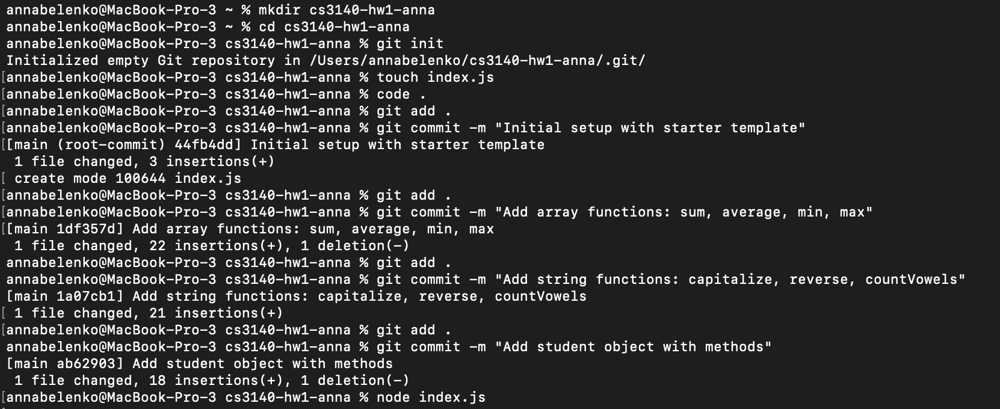
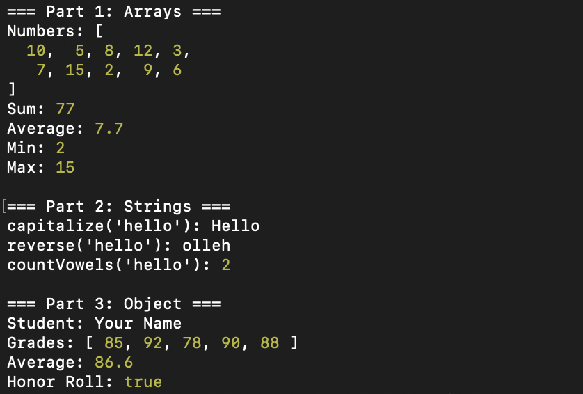
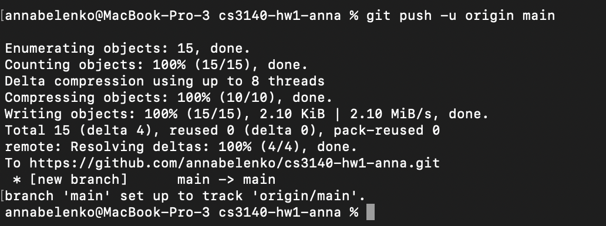

# CS3140 Homework 1 - JavaScript Fundamentals

**Name:** Anna Belenko  
**Date:** January 30, 2026

## Overview

This homework assignment demonstrates fundamental JavaScript programming concepts including array manipulation, string processing, and object-oriented programming.

## Project Structure

- `index.js` - Main JavaScript file containing all homework solutions
- `README.md` - This documentation file

## Assignment Parts

### Part 1: Array Functions
Functions that work with the `numbers` array `[10, 5, 8, 12, 3, 7, 15, 2, 9, 6]`:

- **`sum(arr)`** - Returns the sum of all numbers in the array
- **`average(arr)`** - Returns the average of all numbers
- **`min(arr)`** - Returns the smallest number
- **`max(arr)`** - Returns the largest number

### Part 2: String Functions
Functions that manipulate strings:

- **`capitalize(str)`** - Returns string with first letter capitalized
- **`reverse(str)`** - Returns the string reversed
- **`countVowels(str)`** - Returns count of vowels (a, e, i, o, u)

### Part 3: Object Methods
A `student` object with methods:

- **`getAverage()`** - Returns the average of the student's grades
- **`isHonorRoll()`** - Returns true if average grade > 85

## How to Run

1. Make sure you have Node.js installed
2. Navigate to the project directory
3. Run the program:
   ```bash
   node index.js
   ```

## Screenshots

### Terminal Output






## Expected Output

The program includes test cases that demonstrate all functions working correctly with sample data.

## Technologies Used

- JavaScript (ES6+)
- Node.js

## Learning Objectives

- Array manipulation and processing
- String operations and transformations
- Object-oriented programming in JavaScript
- Function implementation and method chaining